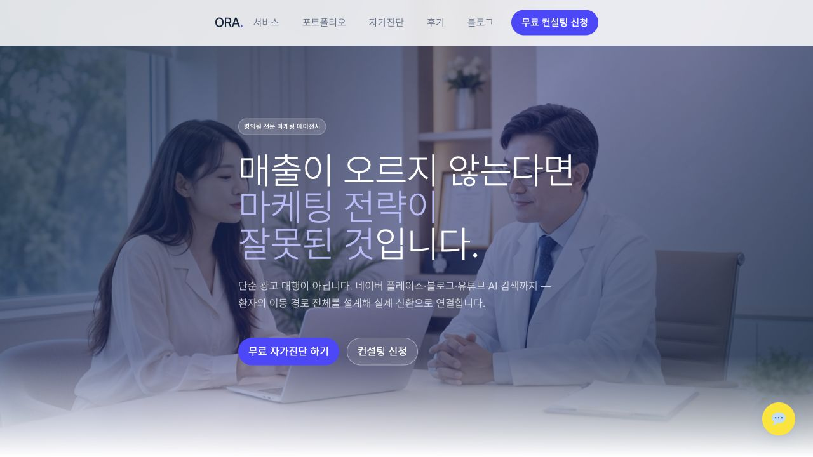
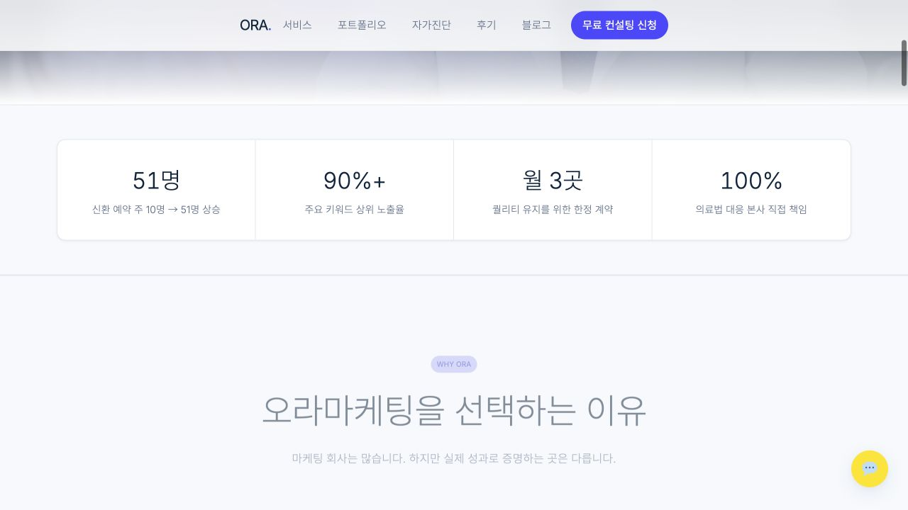
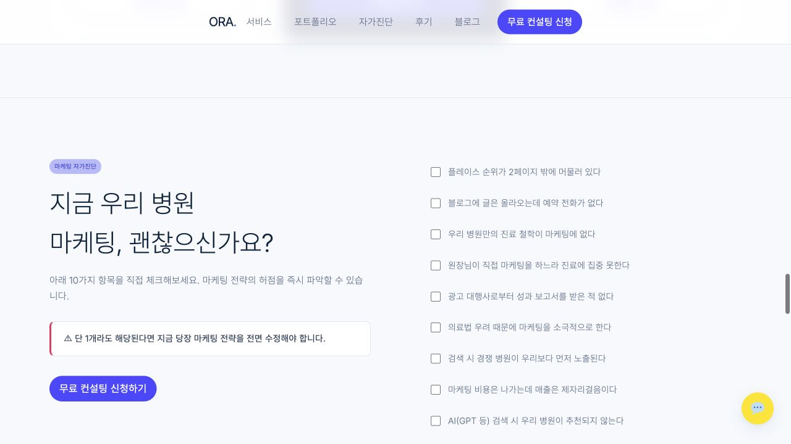
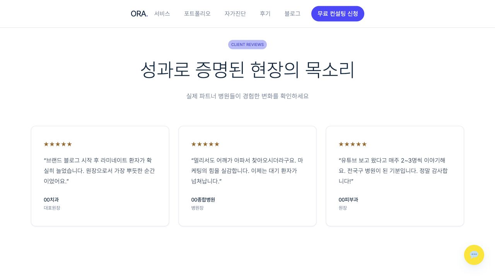
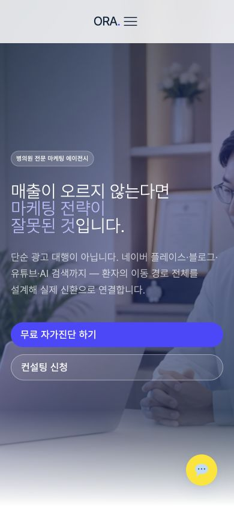

# 오라마케팅 랜딩페이지 벤치마크 리뷰

검수일: 2026-07-25  
대상: https://oramarketing.kr/?utm_source=threads&utm_medium=social&utm_content=link_in_bio#reviews  
목적: 오로라의소리 랜딩페이지 체류시간과 상담 전환 개선에 적용할 요소 선별

## 결론

벤치마킹할 가치가 있다. 특히 첫 화면 배경 영상은 적용을 권한다.

다만 영상 하나가 체류를 만드는 구조는 아니다. 이 페이지는 첫 화면에서 `문제 문장 → 실제 상담 장면 → 두 개의 행동 버튼 → 바로 다음 성과 숫자`를 한 묶음으로 보여준다. 오로라에는 이 구조를 가져오되, 검증하기 어려운 성과 숫자와 과한 위기 문구는 가져오지 않는 편이 맞다.

## 화면별 판정

### 1. 첫 화면

상태: 좋음

- 10초짜리 상담 장면을 화면 전체 배경으로 자동재생한다.
- 영상 위에 어두운 푸른 오버레이를 두어 흰색 카피가 먼저 읽힌다.
- `매출이 오르지 않는다면`으로 문제를 바로 제시한다.
- 자가진단과 상담 신청 버튼을 첫 화면 안에 모두 둔다.
- 영상은 서비스 분위기를 설명하는 장식이 아니라 실제 상담 상황을 미리 보여주는 역할을 한다.

### 2. 성과 숫자와 선택 이유

상태: 시선 유지는 좋지만 신뢰 검증이 필요함

- 첫 화면 바로 아래에 4개 숫자를 배치해 스크롤을 이어가게 한다.
- 숫자 뒤에 선택 이유와 실시간 성과 대시보드가 이어져 증거가 계속 나온다는 인상을 준다.
- 다만 `51명`, `90%+`, `100%`의 기간과 측정 기준이 화면에서 충분히 확인되지는 않는다.
- 오로라는 검증 가능한 숫자가 없으면 숫자 대신 `대표 직접 진단`, `채널 통합 점검`, `진단 후 진행 결정`처럼 운영 사실을 쓰는 편이 안전하다.

### 3. 자가진단

상태: 체류 유도는 좋지만 결과 피드백은 약함

- 체크박스 10개가 방문자를 페이지 안에서 행동하게 한다.
- 자신의 문제를 읽고 선택하게 만들어 단순한 서비스 설명보다 체류에 유리하다.
- 실제로 체크해도 점수나 맞춤 결과가 바뀌지 않아 상호작용은 표면적이다.
- 오로라는 기존 진단 아코디언을 유지하면서 3개 질문 뒤에 `가장 먼저 고칠 지점`을 보여주는 방식이 더 적합하다.

### 4. 후기

상태: 읽기 쉽지만 증거력은 보통

- 카드 3개만 두어 빠르게 읽힌다.
- 병원 업종별 결과 문장이 달라 사례감을 만든다.
- 익명 후기이며 기간·측정 방식·검증 경로가 없어 강한 증거로 쓰기에는 부족하다.
- 오로라는 후기 수를 늘리기보다 실제 사례 1개를 `문제 → 바꾼 것 → 확인된 결과 → 기간`으로 보여주는 편이 낫다.

### 5. 모바일 첫 화면

상태: CTA 노출은 좋지만 영상 크롭과 성능 위험이 있음

- 390×844에서 제목과 버튼 두 개가 첫 화면 안에 들어온다.
- 영상은 모바일에서도 자동재생되지만 좌우가 크게 잘려 상담 상대가 거의 보이지 않는다.
- 일부 애니메이션 요소가 모바일 화면 바깥으로 22px 정도 나가 문서 너비가 412px로 계산된다.
- 영상의 핵심 인물을 가운데 안전 영역에 두지 않으면 모바일에서 의미가 사라질 수 있다.

## 영상 구현 확인

- 길이: 10초
- 해상도: 1280×720
- 프레임: 24fps
- 코덱: H.264
- 파일 크기: 약 1.97MB
- 동작: autoplay, muted, loop, playsinline
- 화면 처리: object-fit cover, opacity 0.55
- poster 이미지 없음
- AAC 오디오 트랙 포함
- 일시정지 버튼 없음
- 장식 영상임을 알리는 aria-hidden 없음

영상은 시각적으로 효과가 있지만 그대로 따라 하면 모바일 다운로드와 움직임 접근성 문제가 생긴다. 오디오 트랙은 제거하고, 첫 화면용 poster를 제공하며, 모션 감소 설정과 정지 방법을 마련해야 한다.

## 오로라 적용안

### 가져올 것

1. 첫 화면 전체 배경 영상
2. 영상 위 강한 오버레이와 현재 문제 중심 카피
3. 첫 화면 안에 보이는 주 CTA
4. 첫 화면 직후 신뢰 근거
5. 방문자가 직접 선택하는 짧은 진단 행동

### 가져오지 않을 것

1. 근거를 확인하기 어려운 강한 성과 숫자
2. `단 1개라도 해당하면 전면 수정` 같은 과한 위기 문구
3. 결과가 바뀌지 않는 10개 체크박스
4. 검증 경로가 없는 익명 후기 여러 개
5. 오디오까지 포함된 2MB 영상 원본

## 권장 영상 기준

- 내용: 대표가 고객 이야기를 듣고 메모하거나 화면을 함께 보는 실제 상담 장면
- 길이: 8~12초
- 편집: 빠른 전환 없이 2~3개 장면
- 모바일 안전 영역: 핵심 인물과 행동을 화면 중앙 40% 안에 배치
- 용량: 가능하면 1MB 이하
- 오디오: 완전히 제거
- 시작 화면: 압축된 WebP poster 제공
- 동작: muted, autoplay, loop, playsinline
- 접근성: 모션 감소 설정에서는 정지 이미지 사용, 반복 영상에는 정지 수단 검토
- 측정: 변경 전후 7일의 광고 세션 평균 체류시간, 참여율, CTA 사용자 수를 같은 조건으로 비교

## 최종 판단

오로라 랜딩에 영상은 넣는 편이 낫다. 다만 목적은 페이지를 화려하게 만드는 것이 아니라 `대표가 직접 듣고 진단하는 회사`라는 사실을 첫 3초 안에 보여주는 것이다.

현재 광고를 7일 채운 뒤 기준값을 고정하고, 영상과 첫 화면 신뢰 근거만 한 번에 수정해 7일 전후 비교하는 방식이 가장 현실적이다.
